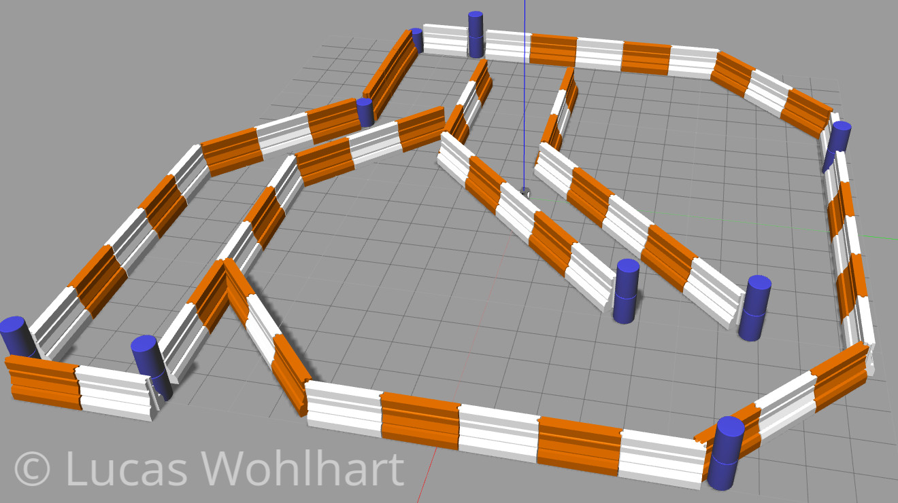
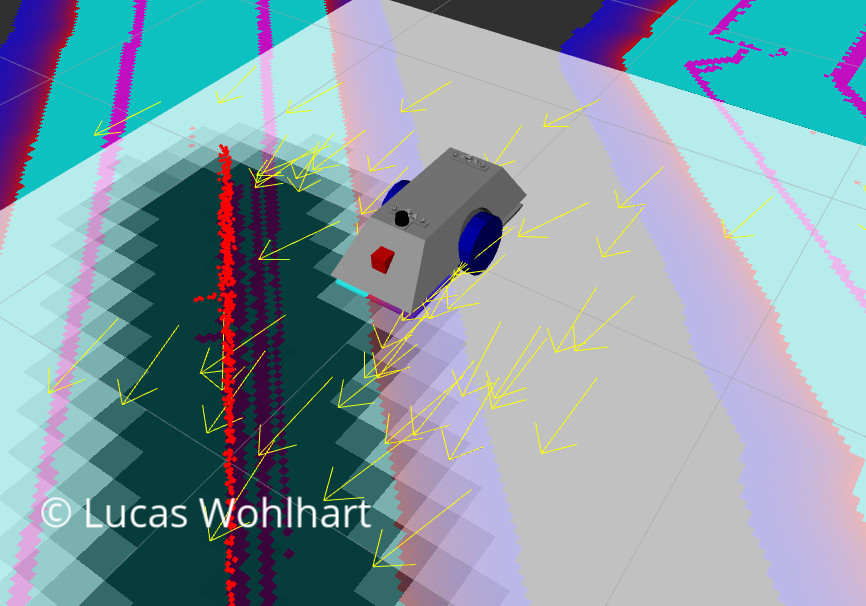
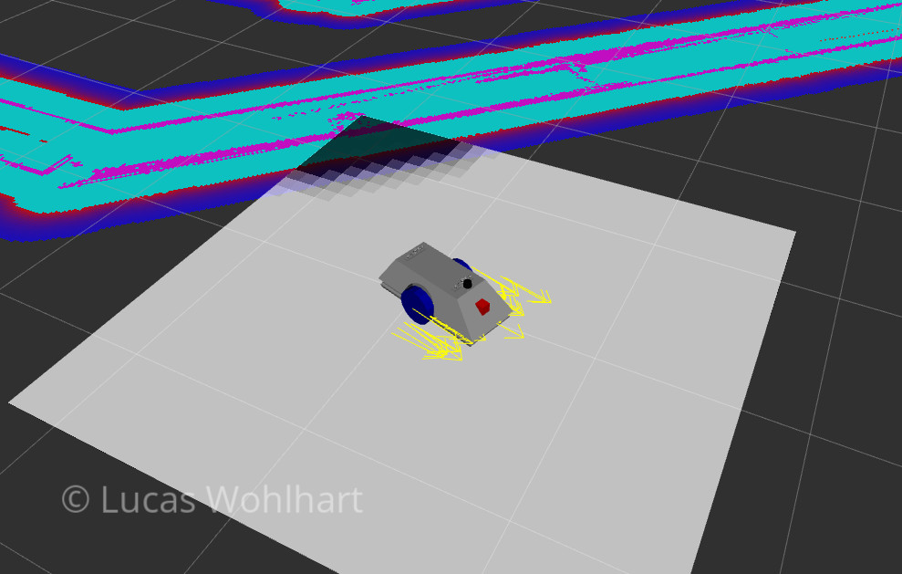
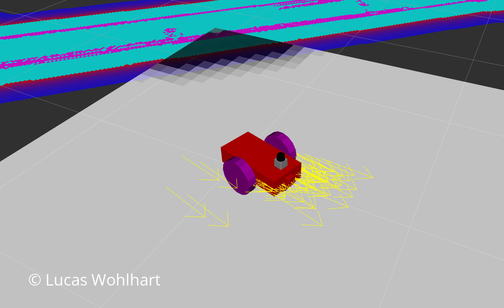

# Udacity Robotics Nanodegree: Project Where Am I?

## Overview

The goal of the project at hand is the examination of the capabilities of a widely used localization technique known asAdaptive Monte Carlo Localization (AMCL). This method is based on a particle filter algorithm which will be conceptionally compared toanother localization strategy using a Kalman Filter. 

For the evaluation of the localization method, two different robots models are placed in a ROS/Gazebo/RViz simulation environment in which they have to navigate through a maze world to reach a specified goal position. 

These two mobile robots both feature a differential drive, one of which is given by the Udacity project description and the creation of the second (custom) robot model as well as the parameterization and inner workings of the project are discussed in *where_am_i.pdf*.

 

**Keywords:** udacity, robotics, localization, amcl

**Author: Lucas Wohlhart, lucas@wohlhart.at**

The package has been tested under [ROS] Kinetic and Ubuntu 16.04. 


## Installation

### ROS requirements
Follow http://wiki.ros.org/kinetic/Installation/Ubuntu to install ROS Kinetic

### Setup workspace
```bash
# setup a clean catkin workspace
mkdir -p ~/catkin_ws/src

# clone the package into src
cd ~/catkin_ws/src
git clone git@github.com:lwohlhart/RoboND-udacity_bot.git udacity_bot

# install ROS dependencies
cd ~/catkin_ws
rosdep install --from-paths src/udacity_bot/ --rosdistro=kinetic

# build catkin workspace
catkin_make
```

## Usage

Make sure to source the ROS package in each terminal used to launch nodes of the package
```bash
source ~/catkin_ws/devel/setup.bash
```
or execute the following command to automatically run it at bash startup
```
echo "source ~/catkin_ws/devel/setup.bash" >> ~/.bashrc
```
Then execute the following commands in separate terminals to simulate the localization and navigation experiment
### Launch the Gazebo/RViz simulation environment
```bash
roslaunch udacity_bot udacity_world.launch
```

### Launch map_server, AMCL particle fitler and move_base
```bash
roslaunch udacity_bot amcl.launch
```
### Send the navigation goal
```bash
rosrun udacity_bot navigation_goal
```
Watch the [Imperial MSE-6](http://starwars.wikia.com/wiki/MSE-6-series_repair_droid) bot navigate the maze and reach it's goal position. Don't forget to listen to the [imperial march](https://soundcloud.com/them-s-production/imperial-march-darth-vaders) while doing so.



## Runing the udacity_bot model

To simulate the udacity_bot simply change the *robot_description* parameter in the *robot_description.launch* file by uncommenting line 5 and commenting line 6 to:
```xml
    <param name="robot_description" command="$(find xacro)/xacro - -inorder '$(find udacity_bot)/urdf/udacity_bot.xacro'"/>
    <!--<param name="robot_description" command="$(find xacro)/xacro - -inorder '$(find udacity_bot)/urdf/lw_mse6_bot.xacro'"/>-->
```
and change the config *costmap_common_params.yaml* to fit the udacity_bot dimensions

```yaml
# footprint: [[0.375, 0.25], [0.375, -0.25], [-0.3, -0.25], [-0.3, 0.25]]
robot_radius: 0.25 # for udacity_bot
```

This configuration spawns the udacity_bot model and navigates it through the maze to the goal position.




# Have fun with the project


